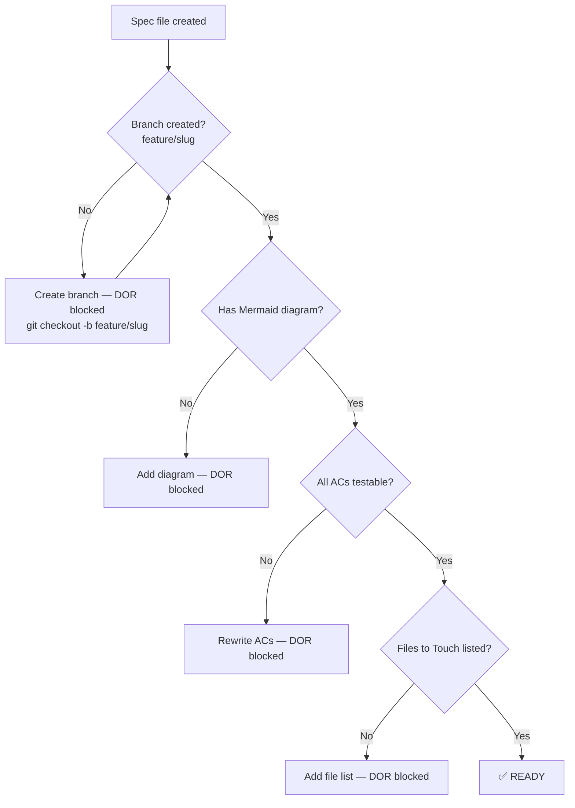
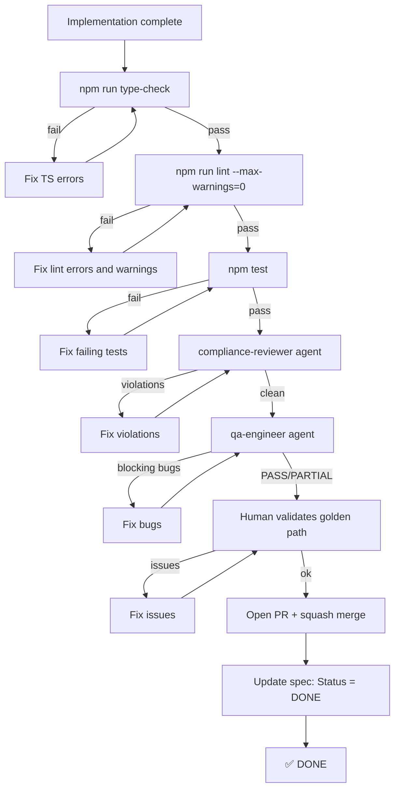
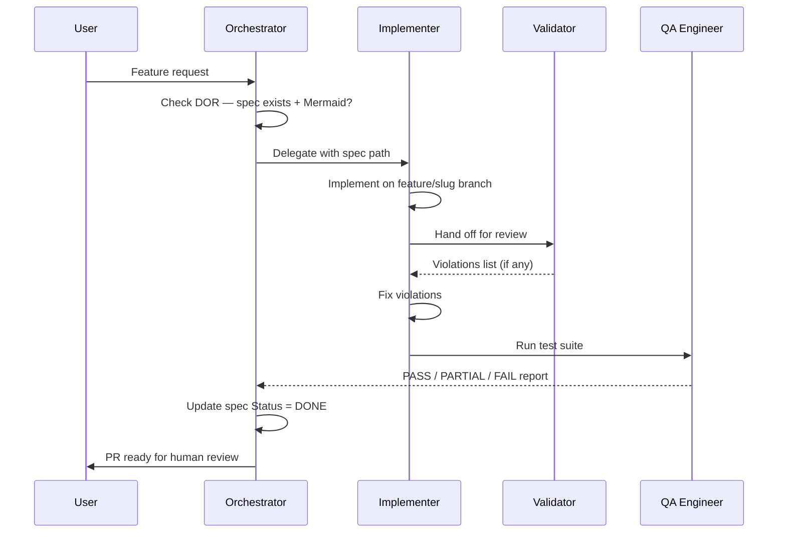

# Definition of Ready (DOR) and Definition of Done (DOD)

Canonical reference for all feature work in AMG SaaS Factory.
Last updated: 2026-04-28

---

## Definition of Ready (DOR)

A task is **Ready** to be picked up when ALL of the following are true.

### Checklist

- [ ] **Feature branch created and checked out** (`git checkout -b feature/<slug>`) — no implementation work starts on `main`, ever
- [ ] Spec file exists in `docs/specs/FEAT-XXX-*.md`
- [ ] Spec contains at least one Mermaid diagram (flow, sequence, or architecture)
- [ ] Acceptance criteria are written as testable checklist items (`- [ ] ...`)
- [ ] "Files to Touch" section lists every file that will change
- [ ] Constraints section identifies compliance rules (LOPDGDD, RD 1457/1986, LSSI-CE, OWASP) that apply
- [ ] Dependencies on other FEATs are noted (e.g. "requires FEAT-009")
- [ ] No external blockers (credentials available, 3rd-party APIs accessible, design approved if UI)

### Mermaid diagram requirements

Every spec must include at least one of:

| Diagram type | When to use |
|---|---|
| `flowchart` | User-facing flows (chatbot, booking, cookie consent) |
| `sequenceDiagram` | Server action ↔ PocketBase ↔ external API interactions |
| `erDiagram` | New PocketBase collections or schema changes |
| `graph` | Component tree or data flow |



---

## Definition of Done (DOD)

A task is **Done** when ALL of the following are verified.

### Checklist

- [ ] All acceptance criteria in spec checked off `[x]`
- [ ] Spec updated: `## Status` section added with completion date and deviation notes
- [ ] `npm run type-check` → exit 0 (**zero TS errors**)
- [ ] `npm run lint` → exit 0 (**zero errors AND zero warnings** — runs with `--max-warnings=0`)
- [ ] `npm test -- --run` → all pass
- [ ] `compliance-reviewer` agent → zero violations
- [ ] `qa-engineer` agent → verdict PASS or PARTIAL (no blocking bugs)
- [ ] Human manual validation of the golden path
- [ ] PR opened on correct branch (`feature/slug`, `fix/BUG-XXX`, etc.)
- [ ] PR squash-merged to `main`
- [ ] Any new env vars added to `.env.example` with comments

### Hard rule on lint warnings

**Zero warnings** is the merge gate, not "low warning count". Per the lint-hardening
PR (chore/strict-lint-and-dod), the CI lint step runs with `--max-warnings=0` so a
single warning fails the build. If a rule produces too much noise to fix in a
PR, do NOT downgrade it to `warn`; instead either:
- Fix all the offending sites, or
- Add a narrow `eslint-disable-next-line <rule>: <reason>` with a comment explaining why,
  or
- Discuss with the team and adjust the rule config (with justification documented).

The strict rules currently active:
- `@typescript-eslint/no-empty-object-type` (no `{}` as a type)
- `@typescript-eslint/no-explicit-any` (no `any` outside test files)
- `@typescript-eslint/no-unused-vars` (allow `_`-prefixed for intentional ignores)
- `@typescript-eslint/no-non-null-assertion` (no `foo!` outside test files)
- `@typescript-eslint/ban-ts-comment` (no `@ts-ignore`; `@ts-expect-error` requires a 10+ char description)
- `@typescript-eslint/no-unsafe-function-type` (no bare `Function` type)
- `@typescript-eslint/no-wrapper-object-types` (no `Object`, `Number`, `String`, `Boolean` as types)
- `reportUnusedDisableDirectives` (rotting suppressions fail the build)

### Spec status update format

When a spec is complete, add this section at the bottom:

```markdown
## Status

**DONE** — 2026-MM-DD

- All AC implemented as specified.
- Deviation: [describe any deviation from original spec, or "none"]
- Follow-up: [link to any deferred items, or "none"]
```

### DOD flow



---

## Branch → Spec lifecycle



---

## Sprint gate summary

| Gate | Tool | Blocks |
|---|---|---|
| Type safety | `npm run type-check` | Commit (pre-commit hook) |
| Lint (zero warnings) | `npm run lint` (`--max-warnings=0`) | Commit (pre-commit hook), CI |
| Unit tests | `npm test -- --run` | Commit (pre-commit hook) |
| Compliance | `compliance-reviewer` agent | PR merge |
| QA | `qa-engineer` agent | PR merge |
| Security | `security-auditor` agent | Sprint release |
| SAST | `semgrep` + `npm audit` | CI pipeline |
| DAST | OWASP ZAP (staging) | Production deploy |
| Human | Manual TC checklist | MVP release |
