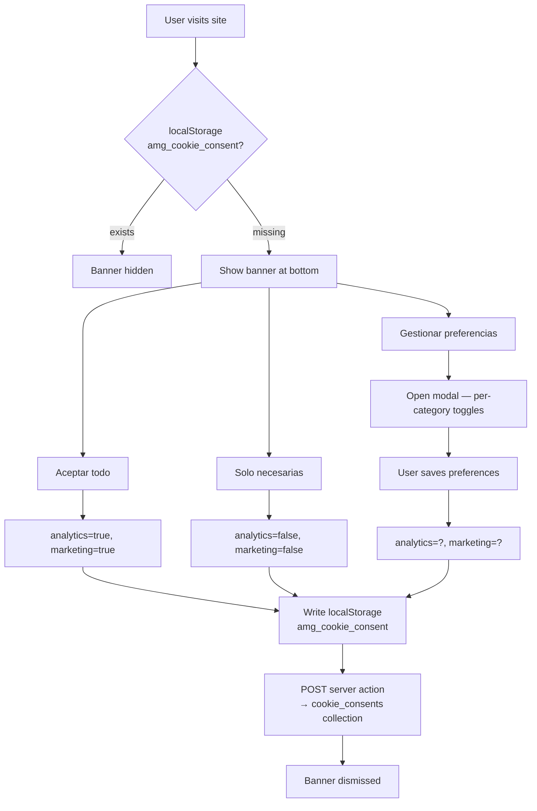

# FEAT-008 — Cookie Consent Banner (LSSI-CE + AEPD 2023)

## Intent

Add a LSSI-CE and AEPD 2023 compliant cookie consent banner to the public site. Canonical spec — supersedes FEAT-006. Consent is logged server-side (PocketBase) for AEPD audit trail and client-side (localStorage) to avoid re-showing the banner on revisit. No analytics or marketing scripts load before consent.

## Consent flow



## Acceptance Criteria

1. [ ] Banner appears at bottom of page on first visit (no prior consent in localStorage)
2. [ ] Banner has **three equal-prominence actions**: "Aceptar todo" / "Solo necesarias" / "Gestionar preferencias" — same font size, same visual weight (AEPD 2023 — no dark patterns)
3. [ ] "Rechazar todo" present in both the banner and the "Gestionar" panel
4. [ ] "Gestionar preferencias" opens a modal/drawer with per-category toggles:
   - **Estrictamente necesarias** — locked ON, cannot be toggled
   - **Analíticas** — OFF by default
   - **Marketing** — OFF by default
5. [ ] No checkbox pre-ticked in the granular panel (no nudge colours on Accept vs Reject)
6. [ ] Consent stored in `cookie_consents` PocketBase collection: `{tenant_id, session_id, analytics: bool, marketing: bool, ip, user_agent, ts}`
7. [ ] Consent also persisted in `localStorage` key `amg_cookie_consent` as `{analytics, marketing, ts}` — banner not shown again until localStorage cleared
8. [ ] No analytics/third-party scripts load before `analytics` consent is given (Plausible gated — Sprint 5)
9. [ ] No marketing scripts load before `marketing` consent (future WhatsApp pixel etc.)
10. [ ] `/politica-de-cookies` link present in the banner
11. [ ] Banner is keyboard-navigable; focus trapped in "Gestionar" panel when open (WCAG 2.1 AA)
12. [ ] Mobile-responsive: banner fits 375px viewport, does not cover full screen
13. [ ] `npm run type-check` → zero exit

## PocketBase Collection: `cookie_consents`

```
cookie_consents {
  tenant_id:   text (required, indexed)
  session_id:  text (random uuid, generated client-side)
  analytics:   bool
  marketing:   bool
  ip:          text
  user_agent:  text
  ts:          date
}
```

Migration required: `pb_migrations/YYYYMMDDHHMMSS_add_cookie_consents.json`

## Session ID strategy

Generate a random UUID client-side on banner mount and store it alongside the consent choice in localStorage. This session_id links the localStorage entry to the PocketBase record for audit.

## Script gating pattern

```ts
// src/lib/consent.ts
export function hasAnalyticsConsent(): boolean {
  if (typeof window === 'undefined') return false;
  const raw = localStorage.getItem('amg_cookie_consent');
  if (!raw) return false;
  return JSON.parse(raw).analytics === true;
}
```

Plausible script (Sprint 5) is loaded only if `hasAnalyticsConsent()` returns true.

## Constraints

- **AEPD 2023**: Reject button MUST be same size and prominence as Accept — no size/colour hierarchy
- **LSSI-CE**: Non-essential cookies require prior informed opt-in
- **No dark patterns**: no pre-ticked boxes, no nudge colours, no confusing labelling
- **Client Component**: banner is `'use client'` — checks localStorage on mount to avoid SSR flash
- **CSS animation only**: no Framer Motion on the banner (performance — loads on every page)
- **Tenant**: `tenant_id` read from config (server action or env) before logging to PB

## Files to Create/Touch

- `src/core/components/CookieBanner.tsx` — new Client Component
- `src/lib/consent.ts` — consent helpers (get/set/check)
- `src/app/layout.tsx` — import CookieBanner
- `pb_migrations/YYYYMMDDHHMMSS_add_cookie_consents.json` — new collection migration
- `src/actions/consent.ts` — `logCookieConsent(data)` server action

## Out of Scope

- Consent revision UI in footer ("Cambiar preferencias") — deferred post-MVP
- Automatic cookie scan / self-updating cookie list
- Backend-only consent without localStorage (not needed — both required)
