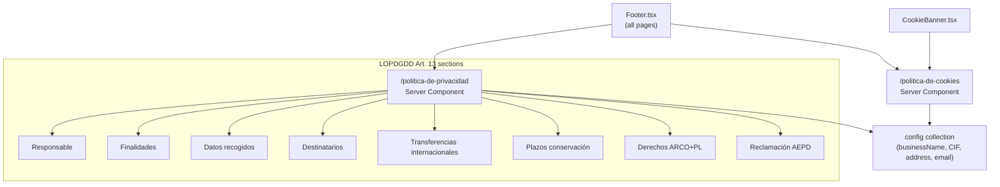

# FEAT-009 — Legal Pages (Privacy Policy + Cookies Policy)

## Intent

Add `/politica-de-privacidad` and `/politica-de-cookies` pages required by LOPDGDD and LSSI-CE. Every Spanish commercial website collecting personal data must have these pages. Content is tenant-configurable (business name, CIF, address, contact). Pages must be static Server Components for SEO.

## Page structure



## Acceptance Criteria

1. [ ] `/politica-de-privacidad` page exists with full LOPDGDD Art. 13 compliant content
2. [ ] `/politica-de-cookies` page exists with LSSI-CE compliant content
3. [ ] Both pages linked from `Footer.tsx` (persistent across all pages)
4. [ ] Both pages linked from the cookie consent banner (FEAT-008)
5. [ ] Content uses tenant config values: business name, CIF, address, contact email, registration number
6. [ ] Pages are Server Components — no client JS, statically rendered
7. [ ] `robots.txt` does NOT block these pages (must be indexable)
8. [ ] `npm run type-check` → zero exit

## `/politica-de-privacidad` — Required sections (LOPDGDD Art. 13)

| Section | Content |
|---|---|
| 1. Responsable | Business name, CIF, address, contact email (from config) |
| 2. Finalidades y base jurídica | Appointment management (Art. 6.1.b — contract); Marketing (Art. 6.1.a — consent) |
| 3. Datos recogidos | Name, phone, email, vehicle plate, appointment details |
| 4. Destinatarios | Resend (email), Twilio (SMS), Sentry (error tracking), PocketBase (hosting) |
| 5. Transferencias internacionales | Twilio (US) and Sentry (US) — Standard Contractual Clauses apply |
| 6. Plazos de conservación | Appointments: 5 years (commercial law); Consent log: 3 years; Cookie consents: 1 year |
| 7. Derechos ARCO+PL | Access, Rectification, Erasure, Portability, Limitation, Opposition — contact email + AEPD link |
| 8. Reclamación AEPD | Link to www.aepd.es |
| 9. Cookies | Reference to /politica-de-cookies |

## `/politica-de-cookies` — Required sections (LSSI-CE)

| Section | Content |
|---|---|
| 1. ¿Qué son las cookies? | Brief explanation |
| 2. Cookies que utilizamos | Table: name, category, purpose, duration, provider |
| 3. Cookies estrictamente necesarias | PocketBase session (auth), chatbot state (localStorage — not a cookie) |
| 4. Cookies analíticas | Plausible Analytics (cookieless — no consent needed, but disclosed) |
| 5. Cookies de marketing | None currently |
| 6. Cómo gestionar las cookies | Link to cookie banner + browser settings instructions |
| 7. Actualización | Last updated date |

## Cookie table (current)

| Cookie | Categoría | Propósito | Duración | Proveedor |
|---|---|---|---|---|
| `pb_auth` | Necesaria | Sesión de staff autenticado en /admin | 30 días | PocketBase (propio) |
| `amg_cookie_consent` | Necesaria | Almacena tu elección de consentimiento | 1 año | localStorage (propio — no es cookie) |

## Config fields required

Add to `clients/talleres-amg/config.json`:
```json
"legal": {
  "cif": "B-XXXXXXXX",
  "registrationNumber": "MU-XXXX",
  "dpoEmail": "privacidad@talleres-amg.es",
  "dataRetentionAppointments": "5 años",
  "dataRetentionConsent": "3 años"
}
```

## Files to Create/Touch

- `src/app/politica-de-privacidad/page.tsx` — new Server Component
- `src/app/politica-de-cookies/page.tsx` — new Server Component
- `src/core/components/Footer.tsx` — add links to both pages
- `clients/talleres-amg/config.json` — add `legal.*` fields
- `public/robots.txt` — verify these paths are not blocked

## Constraints

- **Static content**: no dynamic data fetching except tenant config at build time
- **Spanish only**: es-ES locale, no i18n needed for MVP
- **No hardcoded entity data**: business name, CIF, address come from config — never hardcoded
- **Accessible**: pages must be readable at 375px, proper heading hierarchy

## Out of Scope

- PDF download of policy
- Policy versioning / changelog
- Multi-language versions
- Consent revision widget in footer (post-MVP)
