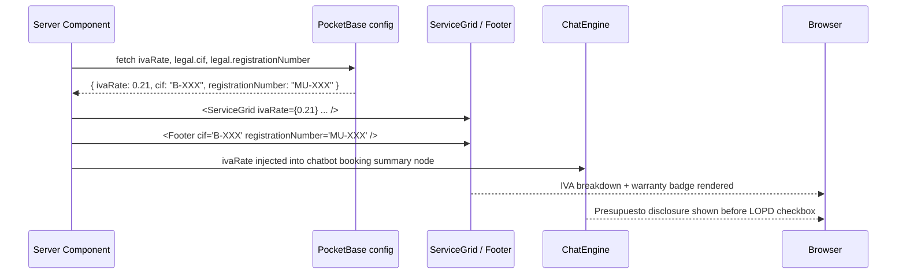

# FEAT-010 — Compliance UI (IVA breakdown, warranty badge, legal footer)

## Intent

Implement all Spain/EU compliance UI elements on the public-facing site: IVA breakdown on service prices (EU Right to Repair Directive 2024/1799), the RD 1457/1986 warranty badge, presupuesto disclosure, and an enriched legal footer. Canonical spec — supersedes FEAT-007.

## Data flow



## Acceptance Criteria

### Service cards (ServiceGrid)
1. [ ] Every service card shows: base price + "IVA (21%)" line + **total** in bold
2. [ ] IVA rate fetched from `config` collection — never hardcoded as `0.21` in display components
3. [ ] Warranty badge on each card: "✓ Garantía 3 meses o 2.000 km — RD 1457/1986"
4. [ ] Section header or CTA includes: "Siempre recibirás presupuesto escrito antes de cualquier trabajo (RD 1457/1986)"

### Chatbot booking flow
5. [ ] Presupuesto disclosure shown in booking summary step before LOPD consent: "Todo trabajo está sujeto a presupuesto previo según el RD 1457/1986"

### Footer (legal line)
6. [ ] Footer includes: `© {year} {businessName} — CIF: {cif} — Inscrito en el Registro de Talleres de la Región de Murcia n.º {registrationNumber}`
7. [ ] Footer includes: "Garantía de reparación: 3 meses o 2.000 km (lo primero que ocurra) · RD 1457/1986"
8. [ ] Footer includes: "Precios orientativos sin IVA, sujetos a presupuesto previo"
9. [ ] OCU (consumer rights) link in footer: `https://www.ocu.org/`

### General
10. [ ] All prices readable on mobile 375px — no truncation
11. [ ] `npm run type-check` → zero exit

## IVA display pattern

```
Cambio de aceite
Base: 39,67 €
IVA (21%): 8,33 €
─────────────────
Total: 48,00 €
```

Note: "precios orientativos" — exact amounts depend on diagnosis.

## Warranty badge content (RD 1457/1986 Art. 16)

Must say **both conditions** — either-or, whichever comes first:
> "3 meses o 2.000 km de garantía en reparaciones (lo primero que ocurra)"

## Config fields required

```json
"legal": {
  "cif": "B-XXXXXXXX",
  "registrationNumber": "MU-XXXX"
}
```

Both values flow from config — never hardcoded.

## Files to Touch

- `src/core/components/ServiceGrid.tsx` — IVA breakdown + warranty badge per card + presupuesto CTA
- `src/core/components/Footer.tsx` — legal footer line with CIF, registration, warranty, OCU link
- `src/core/chatbot/ChatEngine.tsx` — presupuesto disclosure in booking summary node
- `clients/talleres-amg/config.json` — add `legal.cif`, `legal.registrationNumber` if not present

## Constraints

- **IVA always dynamic**: `ivaRate` passed as prop from server-side config fetch — never `0.21` literal in components
- **RD 1457/1986**: both time and km conditions MUST appear — "o" not "y"
- **Design**: use existing glass card and gradient-text tokens — no new design patterns
- **Tenant**: all legal identifiers per-tenant from config

## Out of Scope

- IVA invoice PDF generation (deferred)
- EU Right to Repair 2024/1799 full compliance (effective July 2026 — monitor)
- Price comparison table
- Digital signatures on presupuestos
