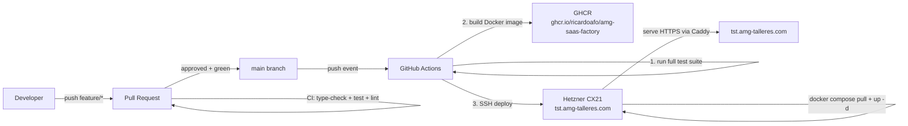
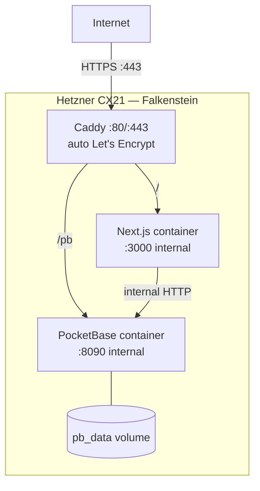

# FEAT-024 — CI/CD pipeline for `tst` environment

## Intent

Ship a fully automated CI/CD pipeline that takes every `main` commit through test → build → deploy to the `tst` Hetzner VPS with zero manual intervention. The pipeline must refuse to deploy broken builds (type errors, failing tests, compliance violations) and must publish each deploy's commit SHA to the site so we can verify what's live. This spec is **`tst` only** — `pro` is deferred per ADR-010.

## Deployment pipeline

## Server topology

## Acceptance Criteria

### CI (pull requests)
1. [ ] Every PR to `main` runs a GitHub Actions workflow with jobs: `type-check`, `test`, `lint`, `flows:validate`
2. [ ] PR cannot be merged if any check fails (enforced by branch protection — documented, not automated)
3. [ ] CI run time < 3 minutes on a fresh checkout
4. [ ] Build step uses `npm ci` (lockfile-respecting, reproducible)

### CD (push to main → tst)
5. [ ] Push to `main` triggers a separate deploy workflow that re-runs tests, builds a Docker image, pushes to GHCR, and deploys via SSH
6. [ ] Deploy workflow exposes the commit SHA in an env var `NEXT_PUBLIC_COMMIT_SHA` so the running site displays which version is live (footer shows short SHA)
7. [ ] Docker image is tagged with both `tst` (moving) and `sha-<commit>` (immutable) — rollback = `docker pull ghcr.io/.../sha-<prev>` on the VPS
8. [ ] If tests fail on `main` (someone force-pushed or branch protection was bypassed), the deploy job does NOT run
9. [ ] Deploy completes in under 5 minutes for a no-op code change (warm Docker cache)

### Server runtime
10. [ ] `tst.amg-talleres.com` serves HTTPS with a valid Let's Encrypt cert, auto-renewed by Caddy
11. [ ] HTTP traffic (`:80`) is automatically redirected to HTTPS
12. [ ] PocketBase admin UI is NOT publicly reachable — only accessible via SSH tunnel (`ssh -L 8090:localhost:8090 <vps>`)
13. [ ] `pb_data` volume survives container restarts and image updates
14. [ ] A `.env` file on the VPS holds runtime secrets (Twilio, Resend, Anthropic, Tenant ID); never committed to the repo
15. [ ] Zero-downtime deploy: running users see no interruption during `docker compose up -d` (Next.js hot swap is acceptable — brief 502 is not)

### Observability (minimal)
16. [ ] Container logs are retained for at least 7 days via `docker compose logs` + Caddy access logs
17. [ ] A `/api/health` Next.js route returns 200 with `{ ok: true, commit: '<sha>' }` — used by a future uptime monitor

### Documentation
18. [ ] `docs/infra/runbook.md` — step-by-step first-deploy, secret rotation, rollback, and disaster recovery (rebuild from scratch)
19. [ ] `docs/infra/github-setup.md` — branch protection rules + required secrets (copy-paste ready)
20. [ ] README updated with a "Deploy" section linking to the runbook

## Stack decisions (from ADR-010)

- **Hetzner CX21**, Falkenstein (€4.99/mo)
- **Caddy v2** as reverse proxy (auto Let's Encrypt, HTTPS redirect, HTTP/3)
- **Docker Compose v2** — three services: `caddy`, `app`, `pocketbase`
- **GHCR** for image registry (free for private repos within quota)
- **GitHub Actions** — two workflows: `ci.yml` (on PR) and `deploy-tst.yml` (on push to main)

## Files to Create/Touch

### Application
- [ ] `Dockerfile` — multi-stage Next.js standalone build; final stage ≤ 200 MB
- [ ] `.dockerignore` — exclude `node_modules`, `.next`, `pb_data`, `playwright-report`, `.env*`
- [ ] `src/app/api/health/route.ts` — GET returns `{ ok, commit, timestamp }`
- [ ] `src/core/components/CommitSha.tsx` — renders short SHA in footer; reads from `NEXT_PUBLIC_COMMIT_SHA`
- [ ] `src/core/components/Footer.tsx` — inject `<CommitSha />` at the bottom right
- [ ] `next.config.ts` — add `output: 'standalone'` for small Docker image

### Infrastructure (committed)
- [ ] `infra/docker-compose.tst.yml` — three-service stack (caddy, app, pocketbase)
- [ ] `infra/Caddyfile` — HTTPS + reverse proxy config, PB admin NOT exposed publicly
- [ ] `infra/.env.tst.example` — template of required runtime env vars (no real secrets)

### CI/CD
- [ ] `.github/workflows/ci.yml` — PR checks: type-check, test, lint, flows:validate
- [ ] `.github/workflows/deploy-tst.yml` — build → push GHCR → SSH deploy
- [ ] `.github/pull_request_template.md` — update to include "Tested on tst" checkbox

### Scripts
- [ ] `scripts/deploy-tst.sh` — runs on the VPS; pulls new image, restarts stack, runs migrations, checks health
- [ ] `scripts/bootstrap-vps.sh` — one-shot server provisioning: install Docker, create user, copy files, start stack

### Documentation
- [ ] `docs/infra/runbook.md` — first-deploy, rotation, rollback, DR
- [ ] `docs/infra/github-setup.md` — branch protection + secrets checklist
- [ ] `README.md` — add "Deployment" section linking to the above

## Required GitHub secrets

| Secret | Used in | Purpose |
|---|---|---|
| `GHCR_PAT` | `deploy-tst.yml` | Push image to GHCR (or use `GITHUB_TOKEN` if public) |
| `TST_SSH_HOST` | `deploy-tst.yml` | e.g. `tst.amg-talleres.com` or raw IP |
| `TST_SSH_USER` | `deploy-tst.yml` | `deploy` (non-root) |
| `TST_SSH_KEY` | `deploy-tst.yml` | Private key for `deploy` user, Ed25519 |
| `TST_KNOWN_HOSTS` | `deploy-tst.yml` | Output of `ssh-keyscan` for the VPS |

Runtime `.env` on the VPS (NOT GitHub secrets — lives in `/home/deploy/.env.tst`):
- `POCKETBASE_URL=http://pocketbase:8090`
- `TENANT_ID=talleres-amg`
- `RESEND_API_KEY=...`
- `TWILIO_ACCOUNT_SID=...`
- `TWILIO_AUTH_TOKEN=...`
- `TWILIO_FROM_NUMBER=...`
- `ANTHROPIC_API_KEY=...`
- `NEXT_PUBLIC_BASE_URL=https://tst.amg-talleres.com`

## Branch protection rules (manual apply on GitHub UI)

Documented in `docs/infra/github-setup.md`. Settings for `main`:
- [ ] Require pull request before merging
- [ ] Require status checks: `type-check`, `test`, `lint`
- [ ] Require branches up to date before merging
- [ ] Dismiss stale approvals on new commits
- [ ] Require linear history (squash merges only)
- [ ] Restrict who can push (nobody, even admins with "include administrators")
- [ ] Automatically delete head branches after merge

## Constraints

- **No secrets in Git** — `.env.tst` lives on the VPS only; `.env.tst.example` is the committed template
- **Tenant isolation preserved** — deploy script must not alter any tenant-scoped config
- **Idempotent deploys** — re-running the deploy job on the same SHA must produce the same result (no `:latest` tags in production compose file)
- **LOPDGDD**: Caddy logs must NOT record full request bodies (only method + path + status) — any PII logging in the app layer is still covered by existing compliance rules
- **Rollback is one command**: `ssh deploy@tst "cd /srv/amg && IMAGE_TAG=sha-<prev> docker compose up -d app"`
- **DNS**: `tst.amg-talleres.com` must resolve to the VPS IP before first deploy (user-owned step)

## Test Cases

| Scenario | Input | Expected output |
|---|---|---|
| Happy path | Push to main, all tests green | `tst` live in < 5 min, footer shows new SHA |
| Failing test on PR | PR with broken test | CI fails, merge button disabled |
| Failing test on main | Force-pushed broken commit | Deploy job skipped, previous `tst` still up |
| Secret rotation | Update `RESEND_API_KEY` on VPS `.env.tst` | Next deploy (or `docker compose restart app`) picks up the new value |
| Rollback | Need to revert to previous image | `IMAGE_TAG=sha-<prev> docker compose up -d` restores prior state in < 60s |
| DNS outage | `tst.amg-talleres.com` returns NXDOMAIN | Caddy serves nothing; monitor alerts (deferred, out of scope for this spec) |
| First install | Fresh CX21, run `bootstrap-vps.sh` | Docker installed, user created, stack started, HTTPS live within 10 min |

## Builder-Validator Checklist

- [ ] No secrets in any committed file (grep `API_KEY|SECRET|TOKEN|PASSWORD` across infra/)
- [ ] Dockerfile uses `node:20-alpine` base; final image < 200 MB
- [ ] Caddyfile does NOT expose `/pb/_/` (PocketBase admin) publicly
- [ ] GHA workflows pin action versions to SHA or major tag — no `@latest`
- [ ] Deploy script exits non-zero on any step failure (`set -euo pipefail`)
- [ ] Health endpoint does not leak tenant data or env vars
- [ ] `npm run type-check` → zero exit
- [ ] `npm test` → all pass
- [ ] `npm run lint` → zero errors
- [ ] All new files follow existing repo conventions (no trailing whitespace, LF line endings for shell scripts)

## Out of Scope

- `pro` environment provisioning (deferred per ADR-010 — recreated from this blueprint when needed)
- Automated PocketBase backups (FEAT-012 Observability)
- Sentry / Plausible / uptime monitoring (FEAT-012)
- CDN / edge caching (premature — Hetzner direct is fast enough for one tenant in EU)
- Blue/green or canary deploys (single-VPS architecture doesn't support it; acceptable at this scale)
- Secrets management via HashiCorp Vault / AWS Secrets Manager (`.env` file is fine at current scale)
- Multi-region failover (one region is enough until we have paying tenants)

## Dependencies

- **Hetzner account** with API token — user-owned; not blocking spec sign-off but required before first deploy
- **Domain** `amg-talleres.com` (or whatever chosen) with DNS pointed at Hetzner — user-owned
- **FEAT-023 (Security OWASP)** — should land first so the deployed image has all hardening; currently on `feature/security-owasp`, not blocking this spec work

## Status

**PROPOSED** — 2026-04-24. Awaiting sign-off from user on domain name + Hetzner account readiness before implementation starts.
