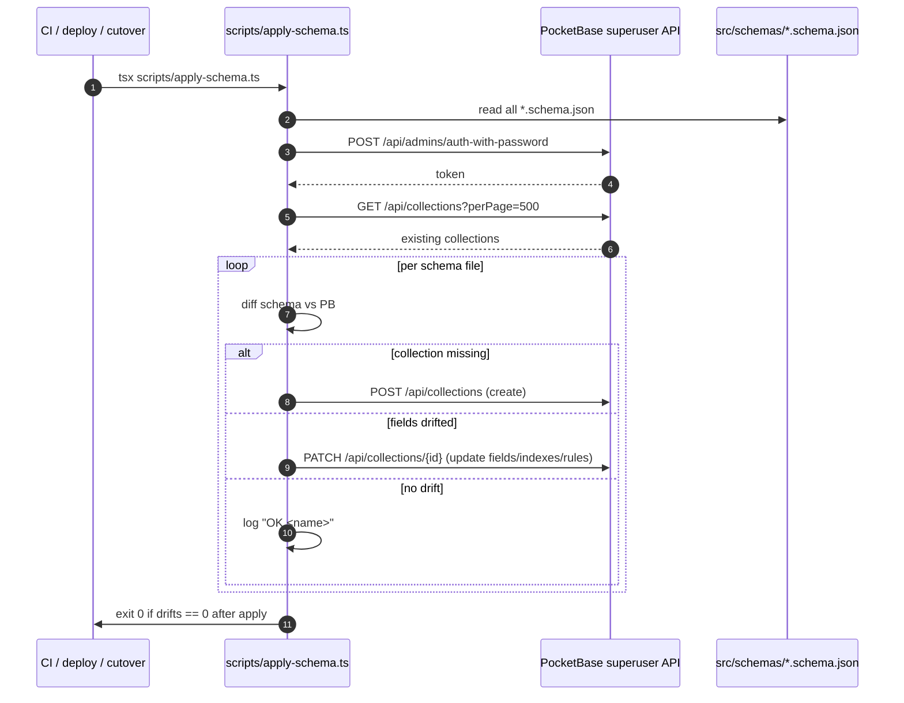

# FEAT-052 — Schema-as-code foundation

## Intent

Replace the current PocketBase schema rot — broken `pb_migrations/*` files that hardcode env-specific collection IDs, and a `db-setup.js` that runs in CI but not in tst deploys — with a single, idempotent, env-agnostic source of truth: TypeScript-applied JSON Schema files in `src/schemas/`. The 2026-04-26 SEV-1 incident (booking dead on tst because `availability_slots` had no schema, only `id`) is the motivating failure. After this lands, the same script that runs in CI also runs against tst (and later pro), so "tests green, production broken" cannot recur.

## Acceptance Criteria

1. [ ] `tsx scripts/apply-schema.ts` against an empty PocketBase produces a fully populated schema with **zero errors**.
2. [ ] A second run of `apply-schema.ts` against an already-populated PB is a **no-op** — exit 0, output `drifts=0`.
3. [ ] Every collection currently referenced in `src/actions/**` has a matching `src/schemas/<name>.schema.json` file.
4. [ ] Each schema file declares: shape (JSON Schema), `x-pb-collection` (collection metadata), `x-pb-indexes` (index list), `x-pb-rules` (access rules).
5. [ ] `tests/db/schema-contract.spec.ts` fails on the **incident-night state** (empty `availability_slots`) and passes after `apply-schema.ts` runs.
6. [ ] `tsx scripts/seed-tenant.ts` produces a working booking flow: 1 tenant, 1 staff, services from `clients/talleres-amg/config.json`, **84 slots for next 14 weekdays**.
7. [ ] `tsx scripts/seed-tenant.ts` is idempotent — re-running does not create duplicates.
8. [ ] Both scripts run in CI against the ephemeral PB and on tst against the live PB. Same script, different env.
9. [ ] No collection ID is hardcoded anywhere in the schemas, scripts, or workflows.

## Constraints

- **Legal**: LOPDGDD — `consent_log` access rules must allow only owner-of-tenant reads. `customer_users` (Week 3) introduces auth fields scoped per-tenant.
- **Performance**: `apply-schema.ts` must complete in < 30 s against a fresh PB. CI cannot tolerate longer.
- **Compatibility**: PocketBase 0.28.x. The PB superuser API surface assumed here is documented at https://pocketbase.io/docs/collections/.
- **Tenant**: every tenant-scoped collection has a `tenant_id` text field with an index. Access rules reference `@request.auth.tenant_id` (staff) or `@collection.customer_users.tenant_id` (customer auth).

## Out of Scope

- **Customer auth schema (`customer_users`, `magic_link_tokens`).** Lands in Week 3 / FEAT-056. The schema files are *defined* in this PR scope so apply-schema.ts can apply them, but the auth wiring (Server Actions, routes, middleware) is FEAT-056.
- **Quote / parts / job_notes / suppliers schemas.** Defined here per [decision 2026-04-27 service-quote-parts-model](../decisions/2026-04-27-service-quote-parts-model.md). The application code that USES them lands in Week 4.
- **Migrating the four bypass admin pages off direct PB queries.** That's FEAT-053 (Week 2).
- **Deleting `pb_migrations/`, `db-setup.js`, `migrations-apply.js`.** Those die in FEAT-055 (Week 5 cutover) once the new path has run cleanly for 7 days.

## Schema file convention

Each `src/schemas/<name>.schema.json` is **standard JSON Schema draft-07** for the data shape, plus three vendor extensions for PocketBase-specific concerns. Convention:

```json
{
  "$schema": "http://json-schema.org/draft-07/schema#",
  "title": "AvailabilitySlot",
  "x-pb-collection": {
    "type": "base",
    "name": "availability_slots"
  },
  "type": "object",
  "required": ["tenant_id", "starts_at", "ends_at", "service_type", "status"],
  "properties": {
    "id": { "type": "string" },
    "tenant_id": { "type": "string", "x-pb-field": { "type": "text", "min": 1, "max": 50 } },
    "starts_at": { "type": "string", "format": "date-time" },
    "ends_at": { "type": "string", "format": "date-time" },
    "service_type": { "type": "string", "x-pb-field": { "type": "text" } },
    "status": { "type": "string", "enum": ["open", "reserved", "blocked"] }
  },
  "x-pb-indexes": [
    "CREATE INDEX idx_avs_tenant_starts ON availability_slots (tenant_id, starts_at)",
    "CREATE UNIQUE INDEX idx_avs_tenant_starts_service ON availability_slots (tenant_id, starts_at, service_type)"
  ],
  "x-pb-rules": {
    "listRule": "tenant_id = @request.auth.tenant_id",
    "viewRule": "tenant_id = @request.auth.tenant_id",
    "createRule": null,
    "updateRule": null,
    "deleteRule": null
  }
}
```

Mapping rules for `apply-schema.ts`:

| JSON Schema input | PocketBase field type |
|---|---|
| `type: string` (no format) | `text` |
| `format: email` | `email` |
| `format: date-time` | `date` |
| `format: uri` | `url` |
| `enum: [...]` (string) | `select` with values |
| `type: number` | `number` |
| `type: boolean` | `bool` |
| `type: array` | `json` |
| `type: object` (nested) | `json` |
| `x-pb-field.type: relation` | `relation` (with `x-pb-field.collectionId`) |
| `x-pb-field.type: file` | `file` |

Required-ness comes from the top-level `required` array. Min/max from `minLength`/`maxLength`/`minimum`/`maximum`. Collections of type `auth` (`x-pb-collection.type: auth`) get PB's built-in auth fields automatically — schema declares only the custom fields.

## Collections in this scope

**Existing (extend with x-pb-* extensions):**
- `tenant`
- `config`
- `consent_log`
- `appointments` (was `booking.schema.json` — rename to match collection name)

**Net-new (created in this PR scope):**
- `availability_slots` — the missing schema that caused the SEV-1
- `services` — service catalog (currently in `clients/<tenant>/config.json` only — promote to PB)
- `customers` — CRM record, linked from appointments
- `vehicles` — vehicle records, linked to customers
- `staff` — admin auth collection (PB type: `auth`)
- `quote_requests` — already exists in code, schema needs declaring
- `sms_log` — Twilio dispatch log

**Defined here, used later (Week 3 / Week 4):**
- `customer_users` — customer auth collection (PB type: `auth`) — wired in FEAT-056
- `magic_link_tokens` — single-use tokens for email magic-link auth — FEAT-056
- `business_hours` — opening hours rule per weekday — Week 4
- `service_capacity` — per-service slot capacity rules — Week 4
- `holidays` — vacation / closure days — Week 4
- `slot_overrides` — manual slot blocks — Week 4
- `quotes` — issued quote (vs `quote_requests` which is the inbound request) — Week 4
- `quote_lines` — line items on a quote — Week 4
- `appointment_parts` — per-job parts tracking — Week 4
- `job_notes` — mechanic note + photo per job (WhatsApp ingest target) — Week 4
- `suppliers` — parts supplier directory — Week 4
- `notification_log` — WhatsApp / email / SMS dispatch log — Week 4

## Test Cases

| Scenario | Input | Expected output |
|---|---|---|
| Happy path: empty PB | Fresh PB, schema files present | All collections created, all fields/indexes/rules applied, exit 0 |
| Idempotency | Schemas already applied | Diff reports 0 drifts, no writes, exit 0 |
| Drift detection | Manually drop a field from PB | Re-run apply-schema → field re-added, drift reported, exit 0 |
| Destructive guard | Schema removes a field | Without `--allow-destructive`, exit non-zero. With flag, field dropped. |
| Seed produces booking | Run apply-schema then seed-tenant | 1 tenant + 1 staff + 6 services + 84 slots present. Booking flow E2E passes. |
| Seed idempotency | Run seed-tenant twice | Second run produces no duplicates. Slot count stays at 84. |
| Schema contract test | Drop `availability_slots.service_type` field | `tests/db/schema-contract.spec.ts` fails with clear message. |

## Files to Touch

- [ ] `src/schemas/tenant.schema.json` — extend with `x-pb-collection`, `x-pb-indexes`, `x-pb-rules`.
- [ ] `src/schemas/config.schema.json` — extend.
- [ ] `src/schemas/consent_log.schema.json` — extend.
- [ ] `src/schemas/appointments.schema.json` — rename from `booking.schema.json` to match PB collection name; extend.
- [ ] `src/schemas/availability_slots.schema.json` — **new**; the missing schema.
- [ ] `src/schemas/services.schema.json` — **new**.
- [ ] `src/schemas/customers.schema.json` — **new**.
- [ ] `src/schemas/vehicles.schema.json` — **new**.
- [ ] `src/schemas/staff.schema.json` — **new**; PB type=auth.
- [ ] `src/schemas/quote_requests.schema.json` — **new**.
- [ ] `src/schemas/sms_log.schema.json` — **new**.
- [ ] `src/schemas/customer_users.schema.json` — **new**; PB type=auth (Week 3 wires it).
- [ ] `src/schemas/magic_link_tokens.schema.json` — **new** (Week 3 wires it).
- [ ] `src/schemas/business_hours.schema.json` — **new** (Week 4 wires it).
- [ ] `src/schemas/service_capacity.schema.json` — **new** (Week 4 wires it).
- [ ] `src/schemas/holidays.schema.json` — **new** (Week 4 wires it).
- [ ] `src/schemas/slot_overrides.schema.json` — **new** (Week 4 wires it).
- [ ] `src/schemas/quotes.schema.json` — **new** (Week 4 wires it).
- [ ] `src/schemas/quote_lines.schema.json` — **new** (Week 4 wires it).
- [ ] `src/schemas/appointment_parts.schema.json` — **new** (Week 4 wires it).
- [ ] `src/schemas/job_notes.schema.json` — **new** (Week 4 wires it).
- [ ] `src/schemas/suppliers.schema.json` — **new** (Week 4 wires it).
- [ ] `src/schemas/notification_log.schema.json` — **new** (Week 4 wires it).
- [ ] `scripts/apply-schema.ts` — **new**; idempotent diff-and-apply.
- [ ] `scripts/generate-slots.ts` — **new**; deterministic slot generator.
- [ ] `scripts/seed-tenant.ts` — **new**; deterministic seed.
- [ ] `package.json` — add scripts: `db:apply`, `db:seed`, `db:slots`.

## Apply flow



## Builder-Validator Checklist

- [ ] All PocketBase queries scoped to `tenant_id` — n/a; this PR is schema, not queries.
- [ ] LOPDGDD: consent logged before any personal data saved — n/a; tested by Week 3 PRs that *use* these schemas.
- [ ] No hardcoded IVA rate (`0.21` / `1.21` / `21%`) — verified: services schema stores `iva_rate` per-service, no constant.
- [ ] No PII in `console.log` / error responses — verified: apply-schema.ts logs collection names only.
- [ ] No hardcoded tenant data (names, prices, config) — verified: seed-tenant.ts reads from `clients/<tenant>/config.json`.
- [ ] `npm run type-check` → zero exit.
- [ ] `npm run lint` → zero exit (zero errors AND zero warnings).
- [ ] `npm test` → all pass.
